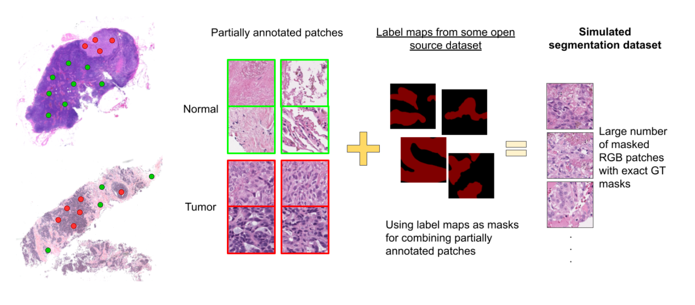
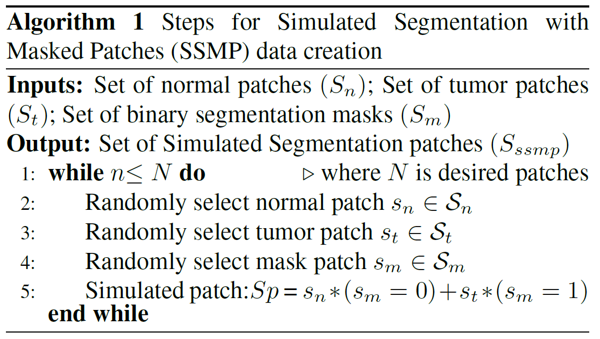
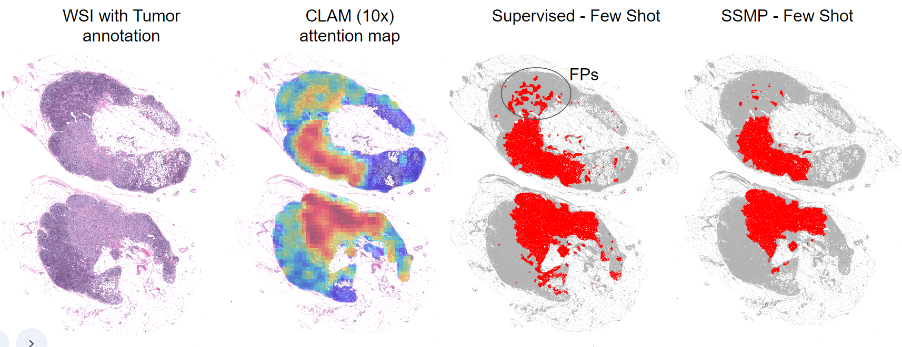
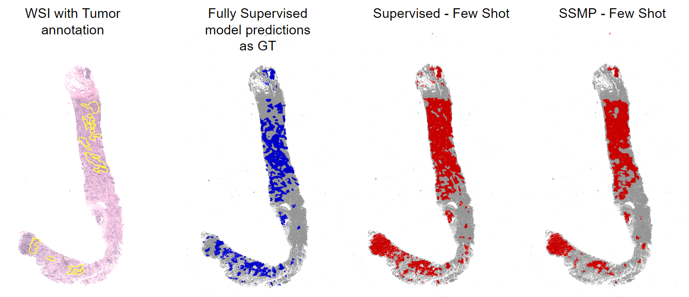

# SSMP: Simulated Segmentation with Masked Patches

## Schematic

## Algorithm

## Dataset and Experiment details

Please check python scrips in BCNB and Camelyon folders. Dataset are accessible through the following links

Camelyon 16 and 17: https://camelyon17.grand-challenge.org/

Breast Cancer Core-Needle Biopsy (BCNB) : https://bupt-ai-cz.github.io/BCNB/

Data splits for few-shot experiments are provided in a text file inside each dataset folder.

Create a simulated segmentation dataset using the following command

python create_ssmp_dataset.py 

## Visualization of Tumor localization performance on Camelyon 16
Model was trained on 5 WSIs from Camelyon 17

## Visualization of Tumor localization performance on MSKCC 
Model was trained on 5 WSIs from Camelyon 17

## Visualization of Tumor localization performance on Breast Cancer Needle Core Biopsies (BCNB) 
Model was trained on 15 WSIs

